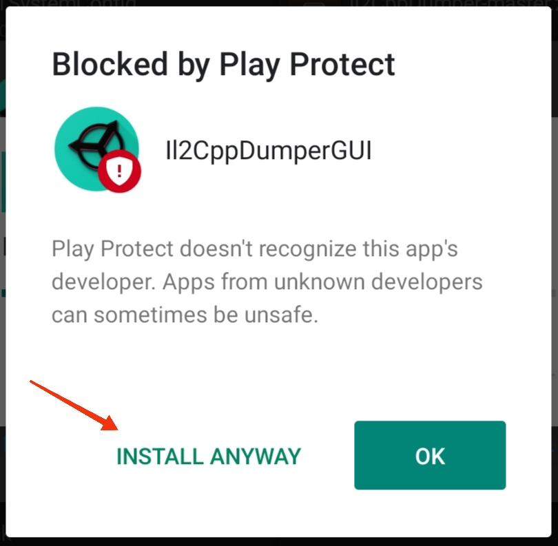

# Il2CppDumperGUI
This is [@Perfare's](https://github.com/Perfare/Il2CppDumper) Modified version of il2cppDumper (GUI)  for Android

# WARNING
* Don't download v1.0 release anymore , cause it have some major bugs
* If you're using v1.0 then uninstall it immediately and download newer version

# Preview

ScreenShots

 

  

# Supported Versions
* Android 5 - Android 12
* API Level 21 - API Level 31

# Tested
  > Tested in Android 6, 9, 11 physical device

# Installation
 While installation process , play protect might warn you . Like this :
 > 
 If so then click 'Install Anyway'

# Often Asked Question
* Does it supports dumping with address of memory ?
> Yes , Dumper will ask you in runtime .
* What about forse dump Version ?
> Yes it's available , in configaration setting !
* What about user input CodeRegistration & MetadataRegistration offset ?
> Yes , Dumper will ask you in runtime .

# Environment
* Project shifted to Visual Studio 2022
* Used Xamarin

# Change Log

 v2.0.0

* Major Update of GUI
* changed package name for better access
* added support for all executable that original dumper supports
  * ELF 32 / 64
  * PE
  * MACH-O FAT / 32 / 64
  * NSO
  * WEB-ASSEMBLY
* reduced overall size
* optimised performance
* Fixed Bugs

 v1.0

* Initial release
* Supported Binary
  * ELF 32 /64

# Notes 
* Protected Target's can't be dump by this dumper (same as [@Perfare's](https://github.com/Perfare/Il2CppDumper) one)
* If you find any bug or problem then please kindly report it I'll try my best to resolve it.
* In low-end devices it take a while to dump .
* output files directory is under 'DumpDroid' folder
# Credits
 * [Il2CppDumper](https://github.com/Perfare/Il2CppDumper)

# Download
>> Download : [Latest Release](https://github.com/Poko-Apps/Il2cppDumpDroidGUI/releases/tag/v2.0.0)
>> Download : [Direct Link[apk]](https://github.com/Poko-Apps/Il2cppDumpDroidGUI/releases/download/v2.0.0/Il2CppDumperGUI_v2.0.0.apk)

# Communication
 * bisbaas89@gmail.com
 * [Discord](https://discord.gg/XxBYZztJdE)
