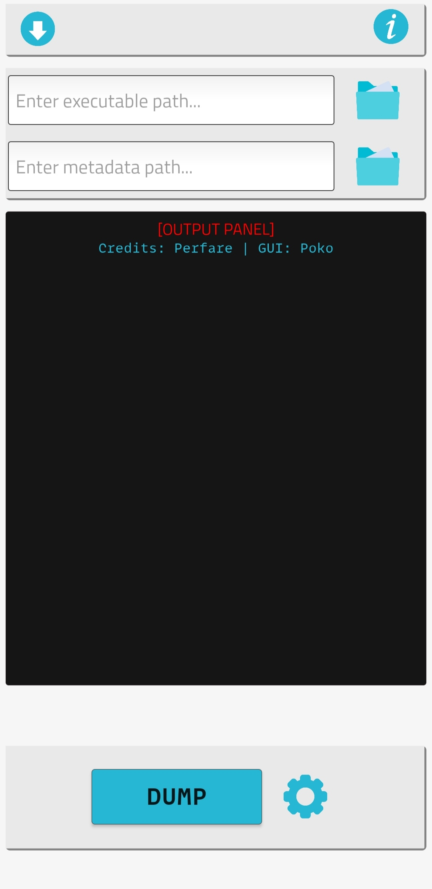
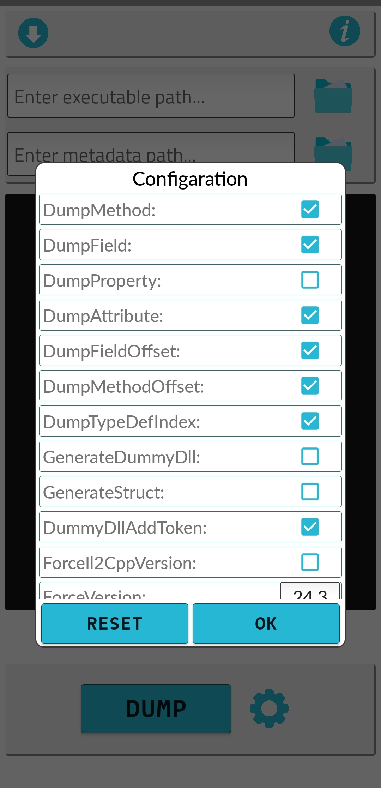
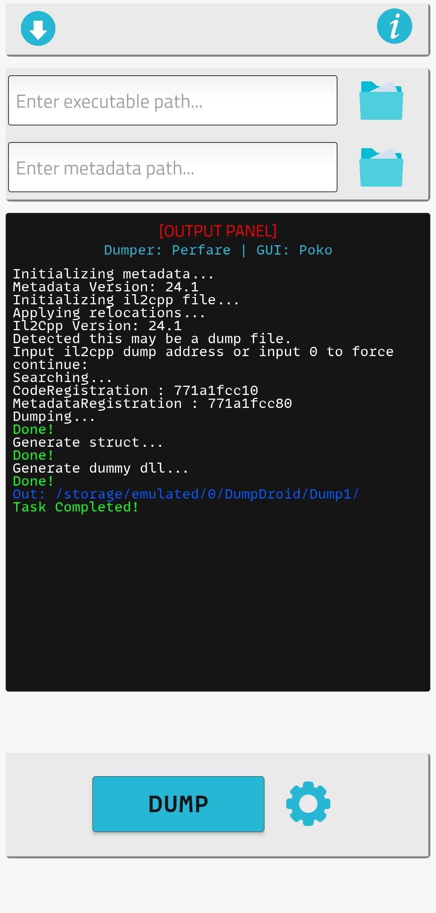
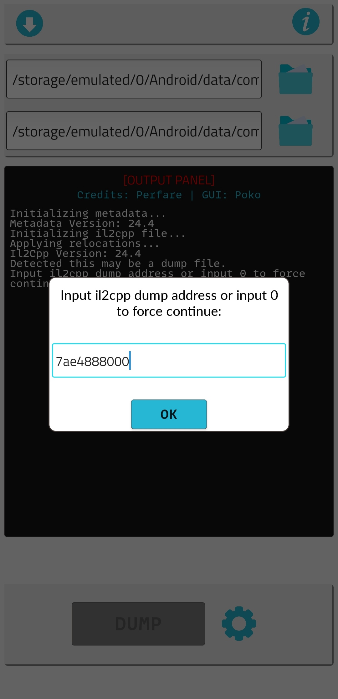

  

<h2 align="center"><b>Il2CppDumperGUI</b></h2>

  This is <a href="https://github.com/Perfare/Il2CppDumper">@Perfare's</a> Modified version of Il2CppDumper (GUI)  for Android

 

    
    
    

## Preview

More ScreenShots

 

  

## Supported Devices
* Android 6 - Android 14
* API Level 23 - API Level 34
* Apk shipped with only **armeabi-v7a** and **arm64-v8a** architecture 

## Tested
  > Tested in Android 6 & 13 physical device

## Recent Change Log

 v2.1.1

* Supports metadata version 31
* Merged latest [commit](https://github.com/Perfare/Il2CppDumper/commit/4741d46ba9cd6159c5d853eb9d6fc48b4bfa2b1a) from upstream
* Fixed [[#issue-4](https://github.com/Poko-Apps/Il2cppDumpDroidGUI/issues/4)]

 v2.1.0

* Merged latest [commit](https://github.com/Perfare/Il2CppDumper/commit/217f1d4737cd9d9d16ab5bef355156bcbc44f9e0) from upstream
* Fixed [[#issue-2](https://github.com/Poko-Apps/Il2cppDumpDroidGUI/issues/2)]
* Project Migration Xamarin.Android -> .NET Android
* Support for Android 14
* Minimum android set to 6
* Saving and Resetting configuration now saved as preferences for next time .
* Output directory log color changed to a bit more bright
* Unused Dump**N** folder inside "DumpDroid" folder now reused in next dump .
* In Configaration Dialog, DumpProperty by default disabled
* Some Code improvements

 

For all change logs [[Click here]](ChangeLogs/ch-logs.md)

## Installation/update
 If you're using version v2.0.1 or older, then please uninstall previous one first .
As I've signed new apks with different keystore.

<i>If installation <b>failed</b> for any reason, uninstall the previous version and try again !!</i>

## Notes 
* Protected Target's can't be dump by this dumper (same as [@Perfare's](https://github.com/Perfare/Il2CppDumper) one)
* If you find any bug or problem then please kindly report it with proper information, I'll try my best to resolve it.
* In low-end devices it take a while to dump .
* Output files directory is under 'DumpDroid' folder
* Visit Perfare's [Dumper](https://github.com/Perfare/Il2CppDumper) , To know more about it .

## Download
>> Download : [Latest Release](https://github.com/Poko-Apps/Il2cppDumpDroidGUI/releases/tag/v2.1.1)
>> Download : [Direct Link[apk]](https://github.com/Poko-Apps/Il2cppDumpDroidGUI/releases/download/v2.1.1/Il2CppDumperGUI_v2.1.1_Performance_AOT+LLVM.apk)

In Latest Release section two variants of apk provided . Performance one is compiled with AOT (Ahead of Time) + LLVM configaration and provides 15-40% faster speed when dumping . classic one is just like old releases and less in size . **Recommend one is Performance apk**

## This Repo
<b><i>This repo is just to distribute the application (apk) and doesn't contain any code at all ,
hence all tags is dummy & have no use . Make your business with just the release section. And not to mention i'm not taking any responsibility for misuse of this app .
</i></b>

## Credits
 * [Il2CppDumper](https://github.com/Perfare/Il2CppDumper)

## Communication
 * [Discord](https://discord.gg/XxBYZztJdE)