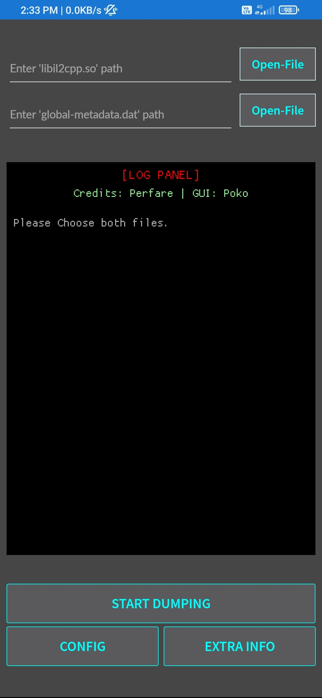
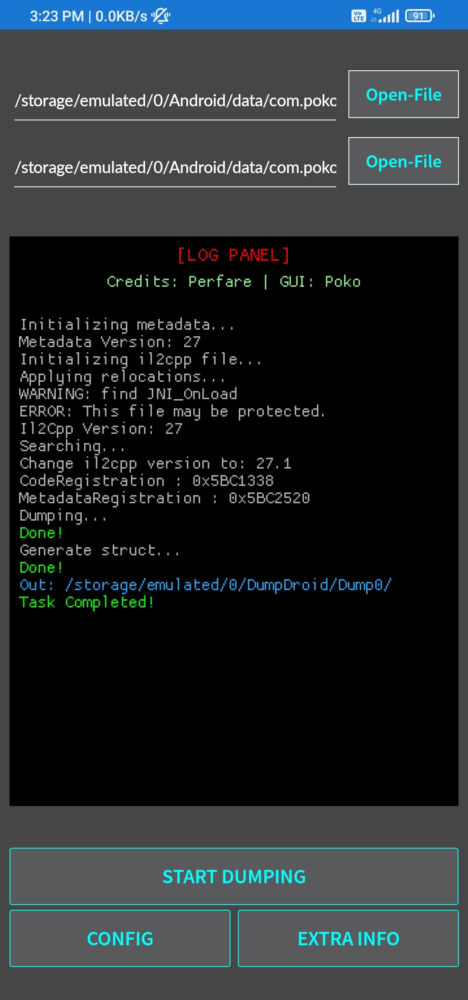

# Il2cppDumpDroidGUI
This is [@Perfare's](https://github.com/Perfare/Il2CppDumper) Modified version of il2cppDumper (GUI)  for Android

# Note
Before Downloading the apk file , you should know 
1) this app may have one or multiple bugs , that i can't guarantee I'll fix in future 🙄
2) maybe your device not compatible for this app
3) at the end I'll say , this is not the app i wanted to make at the first place, due to lack of the resources i didn't make this app optimised .
4) But , maybe in future a better version of this app ( that i wanted to design) will come ! Bcz I've the resources now !

# Preview

# Some Features
1) You can choose what you need by clicking 'CONFIG' button
2) You can add additional information like il2cpp Dump address by clicking 'EXTRA INFO' button
3) Protected Target's can't be dump by this dumper (same as [@Perfare's](https://github.com/Perfare/Il2CppDumper) one)

# Download
>> Download : [Latest Release](https://github.com/Poko-Apps/Il2cppDumpDroidGUI/releases/tag/il2cppDumper)
>> Download : [Direct Link[apk]](https://github.com/Poko-Apps/Il2cppDumpDroidGUI/releases/download/il2cppDumper/Il2CppDumperGUI.v1.0.apk)

# Contact
For cradit releted issues :
1) Gamil: bisbaas89@gmail.com

